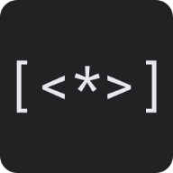

# Smallfuck on the browser.



Smallfuck interpreter built with [AssemblyScript](assemblyscript.org/) and [Preact](https://preactjs.com/).

[Demo](https://smallf-k-interpreter.vercel.app/)

## Installation

After cloning this project:

``` bash
# install dependencies
npm install

# serve with hot reload at localhost:8080
npm run dev

# build for production with minification
npm run build

# test the production build locally
npm run serve
```

## Contributing
Pull requests are welcome. For major changes, please open an issue first to discuss what you would like to change.

## License
[MIT](LICENSE)

